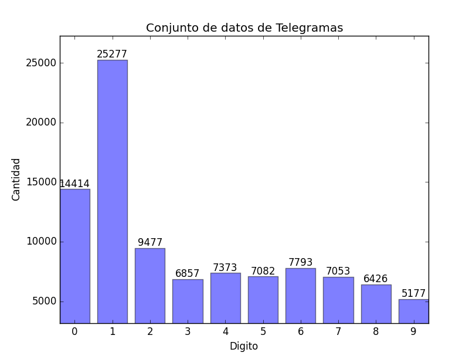

# Creado para poner contenido de la Tesis de Maestria

telSet es un conjunto de datos creado a partir de telegramas electorales en Argentina, Octubre 2013.

Creado durante el desarrollo de mi trabajo de Tesis de Maestria en Mineria de Datos (Universidad de Buenos Aires).
Compuesto por 96927 dígitos, escritos por 2151 personas diferentes.

<a href="https://github.com/walt3rminer/datamining/blob/master/tel_images.csv.gz">Imágenes 24x24 de dígitos manuscritos</a> 
<a href="https://github.com/walt3rminer/datamining/blob/master/tel_labels.csv">Clase del dígito</a> 
<a href="https://github.com/walt3rminer/datamining/blob/master/tel_names.csv">Número del telegrama y lugar</a> 
<a href="https://github.com/walt3rminer/datamining/blob/master/cnn_experiments.py">Cómo leer y usar el set de datos</a>

  
Los PDF originales de los que se obtuvieron las 
imágenes de <a href="https://drive.google.com/file/d/0B3S6fgRmEp2GbHVUemt5SmY4Mlk/view?usp=sharing" target="_new">aqui</a>  

Para convertir un PDF a imagen: 
<pre>
convert -verbose -density 150 -trim eleccion2013/01/pdfs/010110113_4625.pdf -quality 100 -sharpen 0x1.0 010110113_4625.jpg
</pre>

 
Las imágenes de los 2151 telegramas pueden ser obtenidas de aqui (disponible pronto).  

